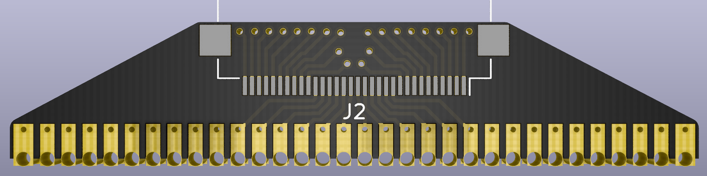
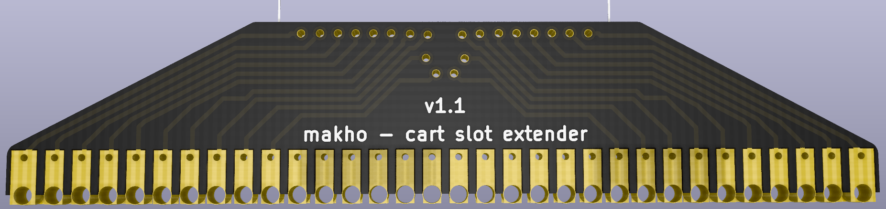

# cartlonger
Like a normal cart slot but way over there instead

Designed for GBA SP case mods, this PCB (well, two of them specifically) will go between the Game Boy Advance SP motherboard and the the cart slot itself and connect via a flat flex cable. You'll still have to make provisions for the mode switch but running four wires is better than 36 wires (or you can just bypass it to lock the GBA SP to GBA or [GBC mode](https://lh5.googleusercontent.com/-XFI77zrjPbE/UZjnVfc7mjI/AAAAAAAACUc/bDwzvWvaZ4E/s800/SW13_lock_gbc_mode.jpg) exclusively).

Now with new features like S Y M M E T R Y and R O U N D E D C O R N E R S and, of course, the fan favorite, vias far enough apart that there are no shorts direct from the fab!

